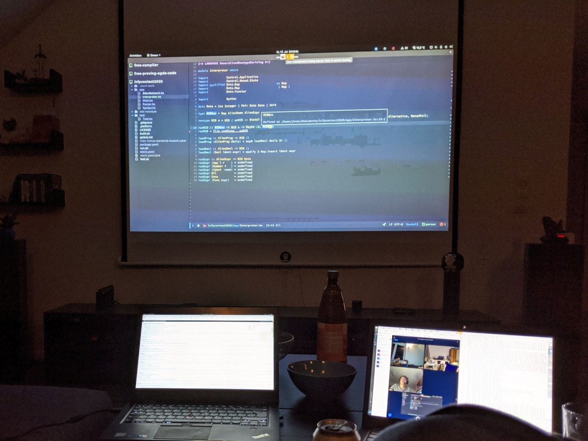
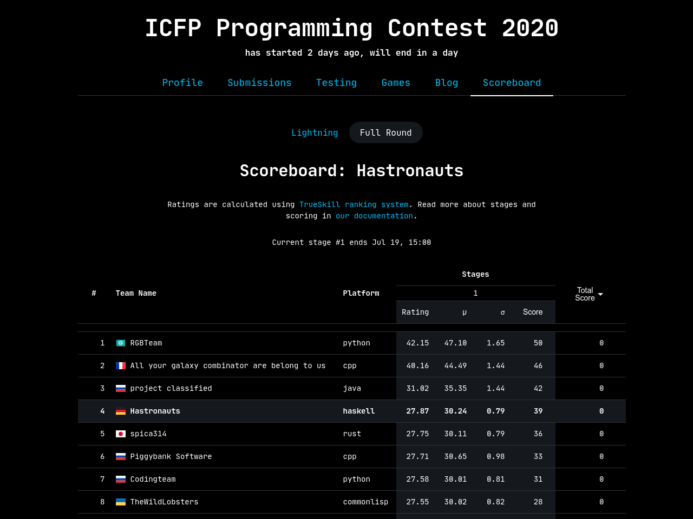
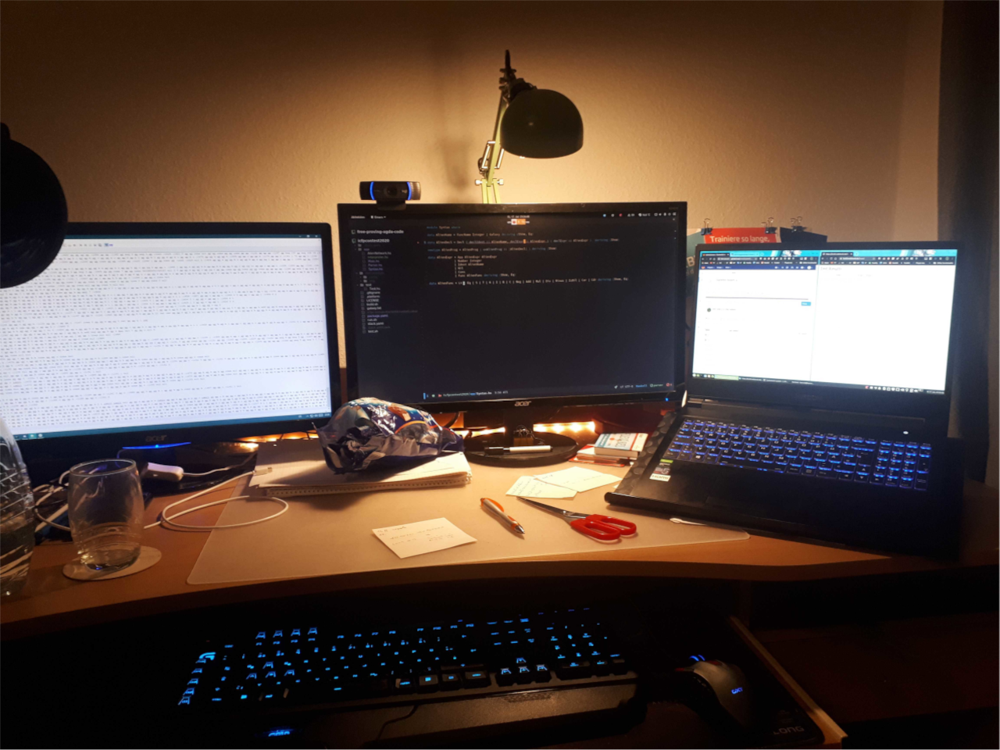

ICFP Programming Contest 2020 - Team Hastronauts 
===============

This is the project repository for team **Hastronauts**'s submissions for the ICFP Programming Contest 2020,
written in **Haskell**.

# Impressions

The start of the contest was a bit surprising since we had expected to be solving a clear set of problems right away,
whereas the actual task was rather vague, which unfortunately did not help with team morale. We postponed our first
hacking session until there was a specific problem to solve, that is, the *huge message* to decode, which was quite
a bit of fun. Nevertheless it would have been a good motivation to have small achievements rewarded with points.

For the space battle part of the contest, we began by implementing a simple but effective strategy -- doing nothing.
During the first hours of space battles, we managed to climb the scoreboard up to fourth place!

After we got the hang of orbital mechanics, which were pretty fun to play with -- although a bit wonky at times, we
were able to achieve stable orbit around the star.

We experimented with forking and sacrificing ships, tried shooting at everything and had fun watching the other battles
on Twitch.

In the end it was a fun contest! Thanks to the organizers,the participants and our fellow Hastronauts!

# Content 

The `GalaxyEvaluator` consists of the `Syntax`, `Parser`, `Interpreter` and `Interpreter.Data` modules.
It is used by the `Test` module to generate two images resulting from evaluating the galaxy interaction protocol 
on the empty state and with the vector (0,0).

# Further Links
- [Contest Page](https://icfpcontest2020.github.io/)
- [ReadTheDocs](https://message-from-space.readthedocs.io/en/latest/personal-appeal.html)
- [Submission Pre-Test System](https://github.com/Skgland/icfp2020-submission-system)

# TODO
- [x] Implement `send` function (Interpreter.sh)
- [x] Move everything but `Main`, `Test`, `DocTest` and `Renderer` to a library in a lib dir 
    - Renderer can't be part of the library as it uses dependencies not available in the container during build,
      as such it can stay with `Test`
    - [x] Move It
    - [x] Change test in package.yaml to have source-dir lib instead of app, should remove warning about `Main` module workaround
- [x] Make galaxy evaluator into an interactive galaxy pad
  - [x] How does the galaxy protocol interact with the world, it does not use the `send` function?
    - Yes, it does use `send`
  - [x] New executable that evaluates galaxy interaction (using evaluator) in a loop
    1. Evaluate from initial input
    2. Display resulting picture, saving resulting state
    3. Wait for user input (`Vector`, `Coordinate`)
    4. Evaluate galaxy protocol from saved state with user input
    5. Continue with second step 
  - How to use:
    - in the package.yaml set buildable to true
    - run `stack run :gui`
    - Controls: `Left Arrow Key` to go back, `Escape Key` to Quit, `Mouse Click` to do a Step with the clicked Coordinate
- [ ] Clean up code
- [ ] Improve documentation
- [ ] Improve and update Readme
- [x] Implement sharing
